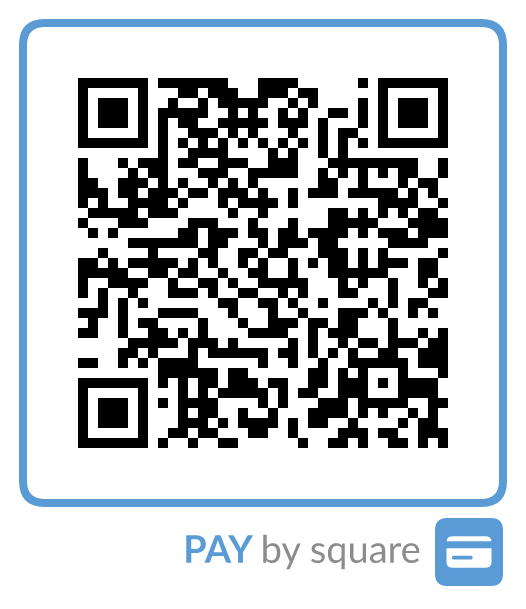

# PAY by square API

Rýchle a jednoduché API na **generovanie a čítanie** platobných QR kódov **PAY by square**
(pre slovenské aj české banky). Beží **bez databázy**, je samostatne hostovateľné (napríklad na
NAS-e) a kód zobrazuje v štandardnom rámčeku PAY by square s nápisom „PAY by square" a ikonou
platobnej karty. PNG aj SVG výstup je **identický** a sebestačný (text je vykreslený ako vektor,
nezávisí od písiem v systéme).

Moderná ASP.NET (.NET 10) náhrada za projekt
[slatinsky/php-pay-by-square](https://github.com/slatinsky/php-pay-by-square), funkčne
porovnateľná s plateným riešením [easy-square.sk](https://www.easy-square.sk/).



## Čo ponúka

- **PNG aj SVG** výstup, oba **vizuálne identické** (plateným službám väčšinou stačí len PNG)
- **Rámček PAY by square** s nápisom a ikonou karty – štandardný vzhľad, dá sa vypnúť alebo prefarbiť
- **Dekódovanie** existujúceho QR reťazca späť na údaje platby (`/decode`)
- **Validácia IBAN** (mod-97) pre SK, CZ a všetky ostatné krajiny
- BIC/SWIFT je **voliteľný**, podpora **mena CZK** a viacerých účtov
- Nastaviteľná veľkosť, okraj, úroveň korekcie chýb a farby
- Bez databázy, bez registrácie, bez API kľúča (voliteľne sa dá zapnúť)
- Interaktívna dokumentácia (Swagger UI) na `/swagger`

## Spustenie cez Docker Compose

Vytvorte súbor `docker-compose.yml` (v tomto repozitári je pripravená šablóna):

```yaml
services:
  paybysquare:
    image: marusko/paybysquare:latest
    container_name: paybysquare
    restart: unless-stopped
    ports:
      - "8080:8080"
    environment:
      TZ: "Europe/Bratislava"
      # PBS_API_KEY: "zmente-ma"      # voliteľné – vyžaduje hlavičku X-Api-Key na /api/*
      # PBS_RATE_LIMIT: "120"          # voliteľné – limit požiadaviek / minútu / klient
```

Potom spustite:

```bash
docker compose up -d
```

A je to. Služba beží na porte **8080**:

- Dokumentácia: `http://<ip-nas>:8080/swagger`
- Príklad QR kódu: `http://<ip-nas>:8080/api/v1/qr?amount=10&iban=SK7283300000009111111118`

Image beží pod neprivilegovaným používateľom a je dostupný pre `amd64` aj `arm64`, takže funguje
na Intel aj ARM NAS-och (Synology, QNAP a pod.).

## API endpointy

### `GET /api/v1/qr` — QR obrázok z parametrov v URL
Ideálne na priame vloženie do `` značky alebo do e-mailu/faktúry.

```
GET /api/v1/qr?amount=25.50&iban=SK7283300000009111111118&vs=1234&note=Faktura%2042&format=png&size=512
```

| Parameter | Význam | Poznámka |
|---|---|---|
| `amount` / `price` | suma | max. 2 desatinné miesta |
| `currency` | mena (ISO) | predvolene `EUR`, pre ČR `CZK` |
| `iban` | číslo účtu (**povinné**) | medzery sa ignorujú, kontrola mod-97 |
| `bic` / `swift` | BIC | voliteľné |
| `vs`, `cs`, `ss` | variabilný / konštantný / špecifický symbol | |
| `date` | dátum splatnosti | formát `RRRR-MM-DD` |
| `note` | správa pre prijímateľa | diakritika sa predvolene odstráni |
| `beneficiary` / `recipient` | názov príjemcu | |
| `format` | `png` / `svg` / `string` / `json` | viď nižšie |
| `size` | cieľová veľkosť strany v px | napr. `256`, `512`, `960` |
| `ppm` | pixelov na modul | alternatíva k `size` |
| `margin` | tichá zóna (okraj) | `true` (predvolené) / `false` |
| `ecc` | korekcia chýb `L`/`M`/`Q`/`H` | predvolene `M` |
| `dark`, `light` | farby QR a pozadia `#RRGGBB` | |
| `logo` | rámček PAY by square (rám + nápis + ikona) | `true` (predvolené) / `false` |
| `brandcolor` | farba rámčeka a nápisu `#RRGGBB` | predvolene modrá |

**Hodnoty parametra `format`:**

| `format` | Čo vráti | Content-Type |
|---|---|---|
| `png` (predvolené) | QR obrázok s rámčekom PAY by square (raster) | `image/png` |
| `svg` | ten istý obrázok ako vektor (vizuálne identický s PNG) | `image/svg+xml` |
| `string` | **iba** zakódovaný reťazec PAY by square ako čistý text (žiadny obrázok) – hodí sa, keď si QR generujete vlastným nástrojom | `text/plain` |
| `json` | ten istý reťazec zabalený v JSON-e: `{ "code": "..." }` | `application/json` |

### `POST /api/v1/qr` — QR obrázok z JSON tela
Telo je objekt platby (viď nižšie); parametre vzhľadu sa zadávajú v URL
(`?format=svg&size=512`).

### `POST /api/v1/encode` — len zakódovaný reťazec
```json
{ "amount": 25.50, "iban": "SK7283300000009111111118", "bic": "FIOZSKBAXXX",
  "variableSymbol": "1234", "note": "Faktúra 42", "beneficiaryName": "Ján Novák",
  "dueDate": "2026-06-28" }
```
→ `{ "code": "0006..." }`

Polia objektu platby: `amount`, `currencyCode`, `dueDate`, `iban`, `bic`, `variableSymbol`,
`constantSymbol`, `specificSymbol`, `originatorReference`, `note`, `beneficiaryName`,
`beneficiaryAddressLine1`, `beneficiaryAddressLine2`,
`alternativeAccounts` (`[{ "iban": "...", "bic": "..." }]`).

### `POST /api/v1/decode` — prečítanie kódu späť na údaje
```json
{ "code": "0006U000F0OSJJ2G9BRQ70..." }
```
→ `{ "crcValid": true, "rawData": "...", "payment": { ... } }`

### `POST /api/v1/validate-iban`
```json
{ "iban": "SK72 8330 0000 0091 1111 1118" }
```
→ `{ "valid": true, "normalized": "SK7283300000009111111118", "error": null }`

### `GET /health`
Kontrola dostupnosti → `{ "status": "ok" }`.

## Zabezpečenie (voliteľné)

| Premenná prostredia | Účinok |
|---|---|
| `PBS_API_KEY` | ak je nastavená, `/api/*` vyžaduje hlavičku `X-Api-Key` so zhodnou hodnotou |
| `PBS_RATE_LIMIT` | počet požiadaviek za minútu na jednu IP adresu; nenastavené = bez limitu |

## Ako funguje kódovanie

1. Zostaví sa reťazec údajov podľa dátového modelu PAY by square (oddelený tabulátormi).
2. Pridá sa kontrolný súčet CRC-32 (little-endian).
3. Komprimácia **raw LZMA1** (`lc=3, lp=0, pb=2, dict=128 KiB`).
4. Pridá sa 4-bajtová hlavička (`00 00` + 2-bajtová dĺžka pôvodných dát).
5. Výsledok sa zakóduje cez base32hex (`0–9 A–V`).
6. Reťazec sa vykreslí ako QR kód.

Výstup je overený oproti referenčnému postupu `xz` a každý vygenerovaný kód je otestovaný, že sa
dá spätne prečítať bežným LZMA dekodérom – QR kódy preto fungujú v bankových aplikáciách.

## Licencia a kredity

PAY by square je štandard Slovenskej bankovej asociácie. Toto je nezávislá implementácia
inšpirovaná pôvodným PHP projektom (Jozef Slatinský, Ján Fečík). Rámček a nápis sú vykreslené
ako vlastná vektorová grafika v štýle štandardu; vykresľovanie PNG aj SVG je úplne vlastné (bez
grafických knižníc tretích strán).

**Všetky závislosti majú permisívne licencie** – žiadne licenčné komplikácie:

| Knižnica | Na čo | Licencia |
|---|---|---|
| LZMA SDK (7-Zip) | kompresia LZMA1 | Public domain |
| QRCoder | výpočet QR matice | MIT |
| Swashbuckle (len API) | Swagger/OpenAPI | MIT |

Nápis „PAY by square" je vykreslený z obrysov odvodených z písma **Lato** (SIL Open Font License);
obrysy sú zapečené pri zostavení a za behu sa už žiadne písmo nepoužíva. Podrobnosti viď
[THIRD-PARTY-NOTICES.md](THIRD-PARTY-NOTICES.md).
